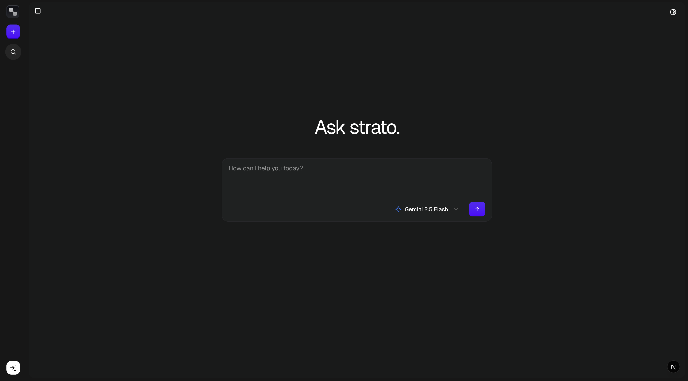

# Strato AI

A modern AI chat application built with Next.js, featuring a clean and intuitive interface for interacting with AI models.



## Tech Stack

### Core Framework
- **[Next.js 15.5.4](https://nextjs.org/)** - React framework with App Router
  - **Turbopack** - Next-generation bundler for faster builds
- **[React 19.1.0](https://react.dev/)** - UI library
- **[TypeScript 5](https://www.typescriptlang.org/)** - Type-safe JavaScript

### Database & ORM
- **[Prisma 6.17.1](https://www.prisma.io/)** - Next-generation ORM
- **[PostgreSQL](https://www.postgresql.org/)** - Relational database

### Authentication
- **[Better Auth 1.3.25](https://www.better-auth.com/)** - Modern authentication library
  - Session management
  - OAuth providers support
  - Email/password authentication

### Security & Rate Limiting
- **[Arcjet](https://arcjet.com/)** - Rate limiting and protection
  - Token bucket algorithm
  - User-based rate limiting

### UI & Styling
- **[Tailwind CSS 4](https://tailwindcss.com/)** - Utility-first CSS framework
- **[shadcn/ui](https://ui.shadcn.com/)** - Re-usable components built on Radix UI
  - **Radix UI** - Unstyled, accessible component primitives
    - Avatar, Dialog, Dropdown Menu, Scroll Area, Select, Separator, Tooltip
- **[Geist Font](https://vercel.com/font)** - Typography
- **[Lucide React](https://lucide.dev/)** - Icon library
- **[Next Themes](https://github.com/pacocoursey/next-themes)** - Dark mode support
- **[Motion](https://motion.dev/)** - Animation library

### Forms & Validation
- **[React Hook Form 7.63.0](https://react-hook-form.com/)** - Form state management
- **[Zod 4.11.1](https://zod.dev/)** - Schema validation
- **[Hookform Resolvers](https://github.com/react-hook-form/resolvers)** - Validation resolvers


## Features

- 🤖 **AI Chat Interface** - Interactive chat with AI models
- 🔐 **User Authentication** - Secure authentication with Better Auth
- 💬 **Chat History** - Persistent chat conversations stored in database
- 🎨 **Dark Mode** - Theme switching with Next Themes
- 📱 **Responsive Design** - Mobile-friendly interface
- ⚡ **Rate Limiting** - API protection with Arcjet
- 🎭 **Modern UI** - Beautiful interface built with shadcn/ui components
- 📝 **Markdown Support** - Rich text rendering for AI responses


## Project Structure

```
strato-ai/
├── prisma/              # Database schema and migrations
├── public/              # Static assets (including strato.png)
├── src/
│   ├── app/             # Next.js app directory
│   │   ├── (main)/      # Main layout routes
│   │   │   └── chat/    # Chat pages
│   │   ├── api/         # API routes
│   │   │   ├── auth/    # Authentication endpoints
│   │   │   └── chat/    # Chat API endpoints
│   │   └── auth/        # Auth pages
│   ├── components/      # React components
│   │   ├── chat/        # Chat-specific components
│   │   ├── ui/          # shadcn/ui components
│   │   └── svgs/        # SVG icons
│   ├── context/         # React contexts
│   ├── hooks/           # Custom React hooks
│   ├── lib/             # Utility libraries
│   └── providers/       # React providers
└── components.json      # shadcn/ui configuration
```

## License

Private project

